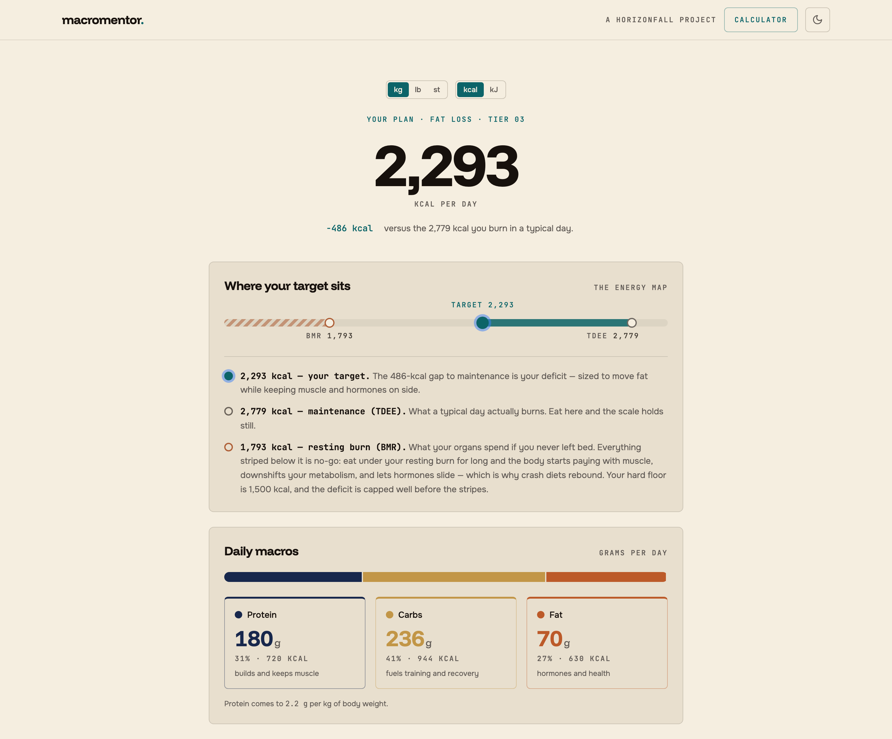
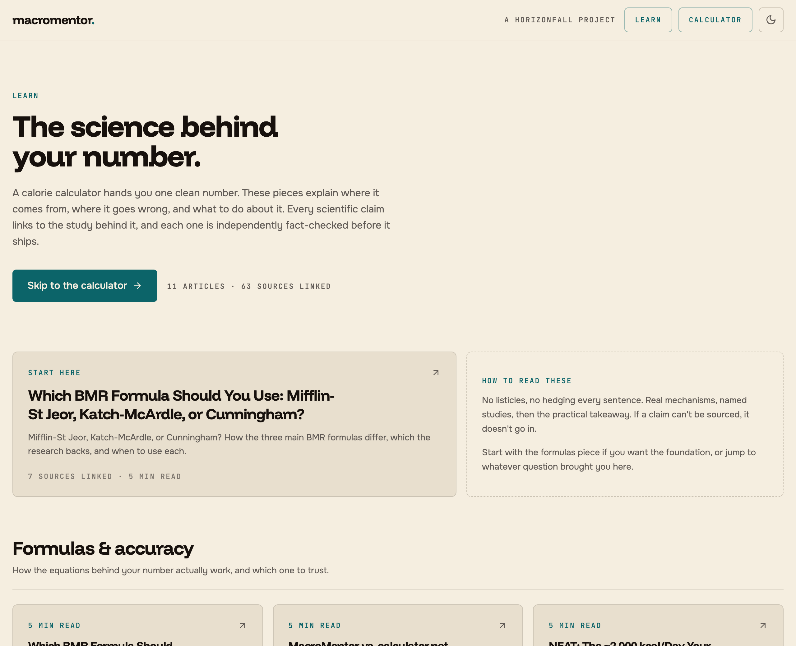

# MacroMentor

**A hyper-personalised calorie and macro calculator. [macromentor.horizonfall.com](https://macromentor.horizonfall.com)**

I decided to get healthy and refused to hand the problem to a generic calorie app. Instead I used deep-research AI tools to read the current academic literature on BMR, TDEE, and macro targeting, the kind of synthesis that used to need a dietitian, a sports-science researcher, or a long stack of journal articles. Then I built the calculator I wished existed. Several personal trainers tried it before launch and called it amazingly useful, and those are people paid to spot bad macro calculators.

## What makes it different

The BMR formula is tiered by what data you can actually give it. Cunningham at the top (needs body-fat percentage and training experience), then Katch-McArdle when you can estimate body fat at all, then Mifflin-St Jeor as the validated fallback, with population-level adjustments applied only where research supports them and flagged transparently in the output whenever they fire.

TDEE comes from a Physical Activity Level multiplier that counts your whole day: job, walking, training. When you're unsure, the calculator nudges you toward the lower level, because almost everyone overestimates. Calorie targets are goal-calibrated with safety caps built in: 1,200 and 1,500 kcal floors, a maximum deficit tied to body-fat percentage, refeed recommendations for aggressive cuts. Goals cover fat loss at several rates, muscle gain scaled to training age, clean and aggressive bulks, maintenance, weight gain, and recomposition. Micronutrient guidance fires for iron, calcium, vitamin D, omega-3, and fibre, with risk flags when waist-circumference thresholds are crossed.

Ancestry input is handled carefully. It's optional, explained before it's asked, and only ever a small refinement in the Mifflin-St Jeor tier. It's skipped entirely when you give a body-fat percentage, and flagged in the output whenever it fires. Only backgrounds with published research behind them are offered at all.

Everything runs in the browser. No account, no server receiving inputs, no database, no tracking scripts. Health information belongs to the person it describes, so the site is statically exported and your numbers never leave the tab.

## Knowing your number is only half the job

A calculator answers "how much." People show up with "why." Why this formula and not that one? Why won't it let me drop below 1,200? Why am I stalled in a deficit that should be working? So MacroMentor grew a companion: **[the Learn hub](https://macromentor.horizonfall.com/learn)**, a set of long-form explainers that each take one of those questions and answer it with real mechanisms and named studies. No listicles, no hedging every sentence.

Every scientific claim links to a verified source, a real PMID that's been checked, not a plausible-looking citation. The pieces run through a research → write → independent fact-check pipeline: one pass gathers and verifies primary sources, a second writes to a fixed house voice, and a third adversarial pass does its own fresh research and corrects the draft. That last step earns its keep. It has caught fabricated duplicate citations, a backwards ethnicity adjustment sitting in the engine itself, and a handful of overstated numbers. Anything touching a sensitive group-level claim (ancestry, sex, metabolism) ships only with a credible linked source, or it gets cut.

Under the hood it's deliberately boring in the right places. Articles are plain markdown, and a small in-house renderer (with its own Vitest suite) turns them into pages, so there's no runtime markdown dependency to carry. A typed content registry is the single source of truth for slugs, categories, and SEO metadata, so publishing a new piece is one entry plus a fact-checked file. Each page is statically generated with `Article` and `BreadcrumbList` structured data, a per-article Open Graph image rendered at build time, a canonical URL, an auto-built references list, and a sitemap entry.

## How it's built

The calculation core is a pure function in `calculator.ts`, covered by a 43-test Vitest suite. Every tier, every formula branch, and every safety cap has a named test case with expected values recorded.

One method I arrived at the hard way: write the tests for each section first, then build against them. My first attempts let the AI build the calculator directly and it kept silently dropping steps, a tier firing wrong, a cap not triggering, a macro floor skipped. Once the tests existed as a specification, the AI-generated implementation was correct. It's the only reliable way I've found to keep AI honest on a multi-branch calculation engine, and it generalises to any complex AI-built system. The content pipeline leans on the same instinct: the fact-checker is a test for prose, an independent pass that has to disprove the draft before it ships.

The interface is a three-step flow that takes about two minutes. The results page shows its working: which formula ran, what multiplied what, where the caps kicked in. Progress and results survive a refresh. They live in session storage, not a server, so if you come back with a plan already saved, it asks whether to pick up where you left off or start over instead of quietly dropping it. Every unit system works inline (metric, imperial, stones, kJ), and a plan prints or exports to PDF in the same layout as the page. The design language is shared with [horizonfall.com](https://horizonfall.com): parchment and near-black themes, mono numerals, film grain, and an accent-coloured full stop.

Stack: Next.js 16, React 19, TypeScript, Tailwind, Radix UI, Vitest, Playwright. No CMS, no markdown library, no analytics SDK.

## License

MIT, see [LICENSE](LICENSE). Clone it, fork it, build on it.

---

Part of [horizonfall.com](https://horizonfall.com). The full story is at **[horizonfall.com/projects/macromentor](https://horizonfall.com/projects/macromentor)**.
