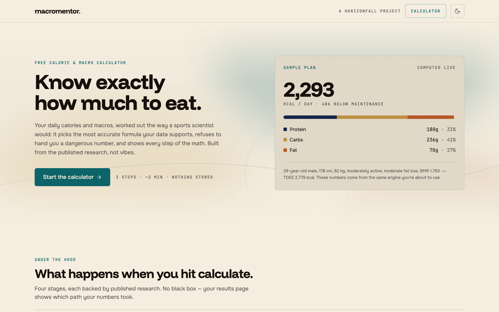

# MacroMentor

**A hyper-personalised calorie and macro calculator. [macromentor.horizonfall.com](https://macromentor.horizonfall.com)**

I decided to get healthy and refused to hand the problem to a generic calorie app. Instead I used deep-research AI tools to read the current academic literature on BMR, TDEE, and macro targeting, the kind of synthesis that used to need a dietitian, a sports-science researcher, or a long stack of journal articles. Then I built the calculator I wished existed. Several personal trainers tried it before launch and called it amazingly useful, and those are people paid to spot bad macro calculators.

## What makes it different

The BMR formula is tiered by what data you can actually give it. Cunningham at the top (needs body-fat percentage and training experience), then Katch-McArdle when you can estimate body fat at all, then Mifflin-St Jeor as the validated fallback, with population-level adjustments applied only where research supports them and flagged transparently in the output whenever they fire.

TDEE comes from a Physical Activity Level multiplier that counts your whole day — job, walking, training — with the calculator nudging you toward the lower level when unsure, because almost everyone overestimates. Calorie targets are goal-calibrated with safety caps built in: 1,200 and 1,500 kcal floors, a maximum deficit tied to body-fat percentage, refeed recommendations for aggressive cuts. Goals cover fat loss at several rates, muscle gain scaled to training age, clean and aggressive bulks, maintenance, weight gain, and recomposition. Micronutrient guidance fires for iron, calcium, vitamin D, omega-3, and fibre, with risk flags when waist-circumference thresholds are crossed.

Ancestry input is handled carefully: optional, explained before it's asked, only ever a small refinement in the Mifflin-St Jeor tier, skipped entirely when body-fat percentage is available, flagged in the output whenever it was used — and only backgrounds with published research behind them are offered at all.

Everything runs in the browser. No account, no server receiving inputs, no database, no tracking scripts. Health information belongs to the person it describes, so the site is statically exported and your numbers never leave the tab.

## How it's built

The calculation core is a pure function in `calculator.ts`, covered by a 43-test Vitest suite. Every tier, every formula branch, and every safety cap has a named test case with expected values recorded.

One method I arrived at the hard way: write the tests for each section first, then build against them. My first attempts let the AI build the calculator directly and it kept silently dropping steps, a tier firing wrong, a cap not triggering, a macro floor skipped. Once the tests existed as a specification, the AI-generated implementation was correct. It's the only reliable way I've found to keep AI honest on a multi-branch calculation engine, and it generalises to any complex AI-built system.

The interface is a three-step flow that takes about two minutes, and the results page shows its working — which formula ran, what multiplied what, where the caps kicked in. The design language is shared with [horizonfall.com](https://horizonfall.com): parchment and near-black themes, mono numerals, film grain, and an accent-coloured full stop.

Stack: Next.js 16, React 19, TypeScript, Tailwind, Radix UI, Vitest, Playwright.

## License

MIT, see [LICENSE](LICENSE). Clone it, fork it, build on it.

---

Part of [horizonfall.com](https://horizonfall.com). The full story is at **[horizonfall.com/projects/macromentor](https://horizonfall.com/projects/macromentor)**.
